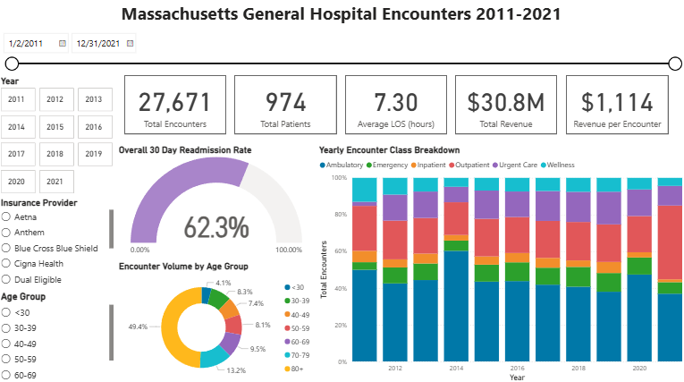
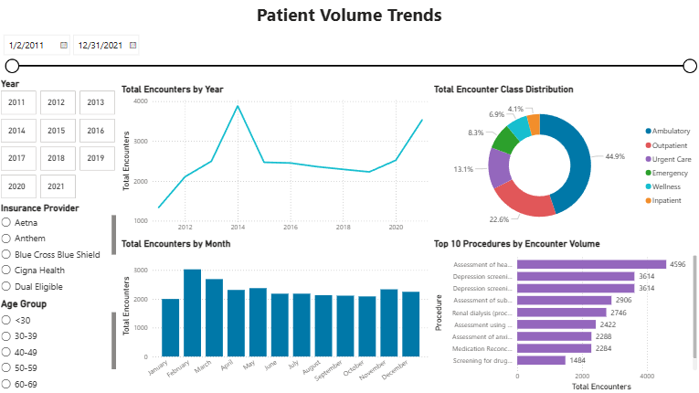
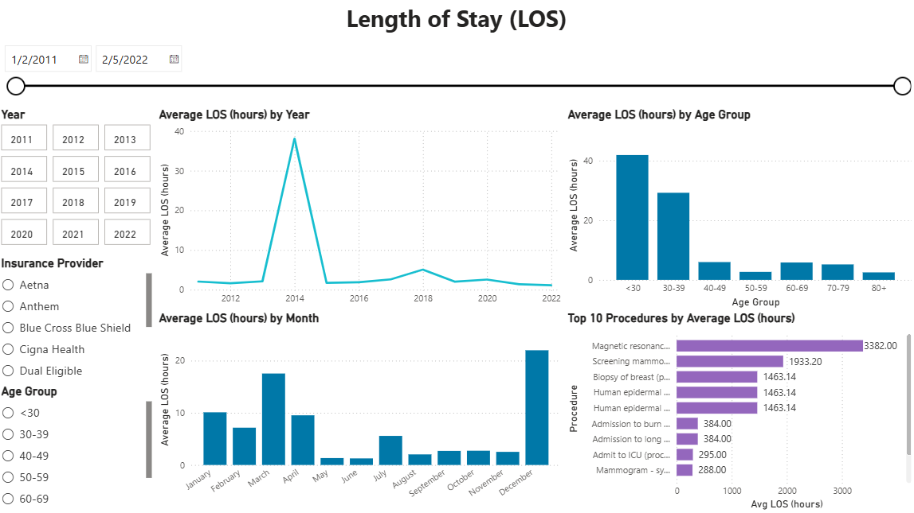
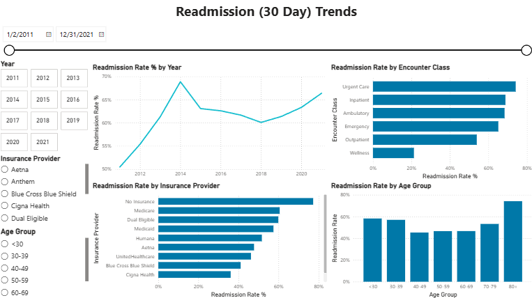
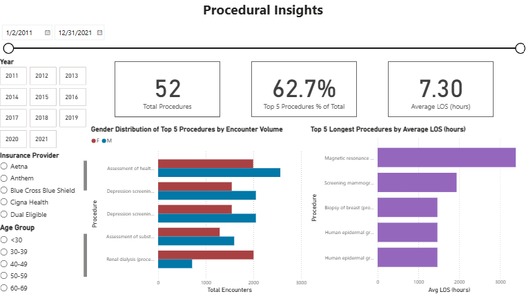

# PowerBI Hospital Encounters Dashboard

---

## Project Overview
This Power BI dashboard analyzes 27,891 hospital encounters recorded between 2011 and 2022.
The goal was to uncover patterns in patient volume, length of stay, readmission rates, and revenue - enabling data-driven insights to improve hospital operations and patient outcomes.

---

## Dashboard Structure
# 1. Dashboard Overview

### **Key Questions Answered**
- How many encounters and patients were seen between 2011–2022?
- What is the hospital’s overall 30-day readmission rate?
- How have encounter classes (Emergency, Inpatient, Outpatient, etc.) shifted over time?
- How is encounter volume distributed across different age groups?

### **Key Visuals**
- KPI cards: Total Encounters, Total Patients, Average LOS (hours), Total Revenue, Revenue per Encounter  
- 30-Day Readmission Rate (donut)  
- Yearly Encounter Class Breakdown (stacked column chart)  
- Encounter Volume by Age Group (donut)  
- Slicers: Year, Insurance Provider, Age Group  

Insight: The hospital maintained consistent patient throughput over the decade, with outpatient and ambulatory visits driving most of the encounter volume.

---

# 2. Patient Volume Trends

### **Key Questions Answered**
- How has total encounter volume changed year-to-year?
- What seasonal patterns exist in monthly encounter counts?
- How are encounter classes distributed overall?
- Which procedures are performed most frequently?

### **Key Visuals**
- Total Encounters by Year (line chart)  
- Total Encounter Class Distribution (donut)  
- Total Encounters by Month (column chart)  
- Top 10 Procedures by Encounter Volume (bar chart)  
- Standard slicers: Year, Insurance Provider, Age Group  

Insight: Encounter volume peaks in 2014 and 2020–2022, aligning with outpatient and urgent care growth.

---

# 3. Length of Stay (LOS)

### **Key Questions Answered**
- How has average LOS trended from 2011–2022?
- Which age groups experience the longest LOS?
- What does LOS look like month-to-month?
- Which procedures result in the longest stays?

### **Key Visuals**
- Average LOS by Year (line chart)  
- Average LOS by Age Group (bar chart)  
- Average LOS by Month (column chart)  
- Top 10 Procedures by Average LOS (bar chart)  
- Slicers: Year, Insurance Provider, Age Group  

Insight: Patients under 30 and 30–39 had the longest stays, averaging ~30–40 hours, while LOS spikes in early 2014 and late 2021 indicate episodic operational bottlenecks.

---

# 4. Readmission (30-Day) Trends

### **Key Questions Answered**
- How has the 30-day readmission rate changed over time?
- Which encounter classes have the highest readmission rates?
- How do readmission rates differ across insurance providers?
- Which age groups show heightened readmission risk?

### **Key Visuals**
- Readmission Rate by Year (line chart)  
- Readmission Rate by Encounter Class (bar chart)  
- Readmission Rate by Insurance Provider (bar chart)  
- Readmission Rate by Age Group (bar chart)  
- Standard demographic and insurance slicers  

Insight: Urgent Care and Inpatient classes show the highest readmission rates, particularly among patients aged 70+, suggesting opportunities to improve post-discharge follow-up.

---

# 5. Revenue Trends

### **Key Questions Answered**
- How has total revenue evolved from 2011–2022?
- Which insurance providers contribute the most revenue?
- Which procedures generate the highest total revenue?
- How does average revenue per encounter vary by payer?

### **Key Visuals**
- Total Revenue by Year (line chart)  
- Average Revenue per Encounter by Insurance Provider (column chart)  
- Top 10 Procedures by Total Revenue (bar chart)  
- Total Revenue by Insurance Provider (column chart)  
- Filters: Year, Insurance Provider, Age Group  

Insight: Medicare and Blue Cross Blue Shield together account for nearly 70 % of total revenue, while cardiology and radiology procedures are the largest financial drivers.

---

# 6. Procedural Insights

### **Key Questions Answered**
- How many distinct procedures were performed?
- What proportion of total encounters comes from the top procedures?
- What is the gender distribution of the most common procedures?
- Which procedures result in the longest length of stay?

### **Key Visuals**
- KPI cards: Total Procedures, Top 5 Procedures % of Total, Average LOS  
- Gender Distribution of Top 5 Procedures (stacked bar)  
- Top 5 Longest Procedures by Average LOS (bar chart)  
- Slicers: Year, Insurance Provider, Age Group 

Insight: MRI and screening procedures account for over 60 % of total volume, with slight gender variation favoring female patients in preventive care services.

---

**Design & Interactivity**
  - Shared slicers across all pages: Year, Insurance Provider, Age Group, and a timeline range slider.
  - Data labels applied selectively for clarity.
  - Dynamic text cards summarize selected slicer values for contextual storytelling.
  - Data refresh is automated through SQL Views (encounter data through Feb 2022).

**Key Takeaways**
  - Hospital handled steady growth in encounters from 2011–2022.
  - Average LOS remained stable around 7.25 hours.
  - Readmissions remain elevated in inpatient and urgent care settings.
  - Revenue growth driven by public insurers and a handful of high-value procedures.
  - Procedural distribution dominated by radiology and screening services, consistent with modern outpatient trends.

